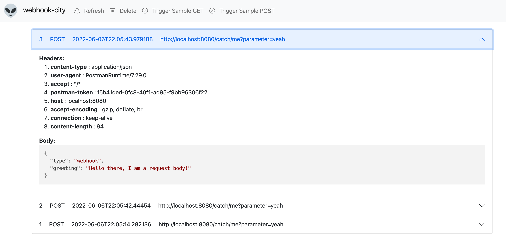

# Webhook-City

**Latest version:** 0.4.2

## What is this?

**webhook-city** is a handy application to test your webhook calls, e.g. in an e2e test scenario.
Use it in your test-environment to catch all outgoing webhooks of your systems that you test.
**webhook-city** acts as a drop-in replacement for, e.g.:

- your own APIs, that receive your webhooks
- third-party APIs, e.g. the Slack API

Spin up the **webhook-city** docker image, send your webhooks and use the API to fetch and verify what was received
by **webhook-city**. There is also a simple UI, that will help you understand what you are sending out and to write tests.

This project is inspired and similar to [MailHog](https://github.com/mailhog/MailHog).

In the end, this is a dockerized application that you need to self-host, that gives you basic functionality like [requestbin.com](https://requestbin.com/) or [webhook.site](https://webhook.site/).

## What is this not?

- It is **not a mock**, meaning you cannot define what response will be returned.
- It is **not a proxy**, meaning requests are not forwarded. All incoming requests (URL, headers, body) are persisted
and can be fetched via the provided API.


## How to use?

### Setup

The setup is minimal. Use the docker image to easily spin up a container:

```zsh
docker run -p 8080:8080 webhookcity/webhookcity:latest
```

All docker images can be found on [dockerhub](https://hub.docker.com/repository/docker/webhookcity/webhookcity/general).

### Catch a webhook

The application catches all incoming webhooks that are sent to ``/catch`` or and path below that (``/catch/**``), e.g.:

- http://localhost:8080/catch
- http://localhost:8080/catch/me/please?hello=there#test

The supported HTTP verbs are: **GET, POST, PATCH, PUT, DELETE, HEAD**
The full URL, all headers and the request body are stored and can be retrieved via the API.


### API usage

For automated e2e test scenarios, you can use the provided API to fetch webhooks that where received. Here are all the 
endpoints that can be used:

- GET ``/api/v1/health``: Simple health endpoint.
- GET ``/api/v1/requests``: Get all webhooks that have been received.
- DELETE ``/api/v1/requests``: Use this endpoint to clear the webhook in-memory storage, useful e.g. after every test scenario.


## UI

The web UI is available at: http://localhost:8080



## Licence

Released under MIT license, see [LICENSE](https://github.com/bayerls/webhook-city/blob/main/LICENSE.md) for details.

## Third party 

- Favicon and logo [Alien](https://favicon.io/emoji-favicons/alien)

## How To Build

```
mvn compile jib:build
```
